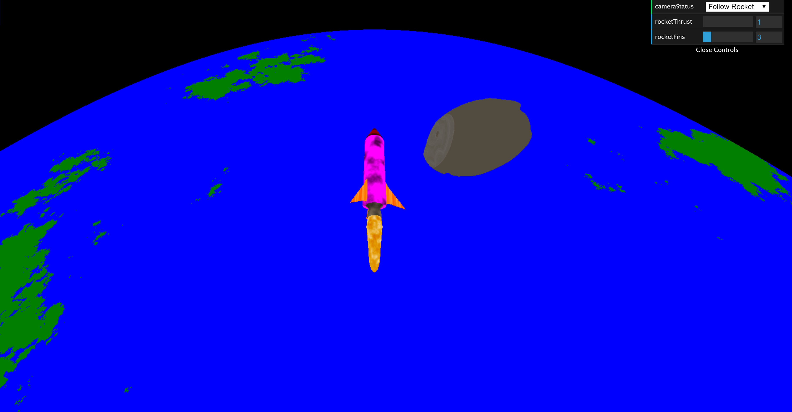
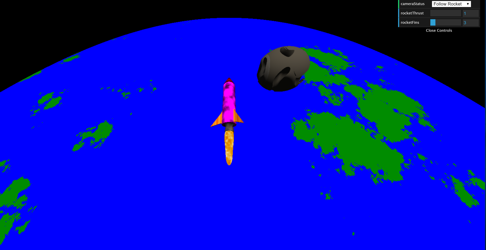
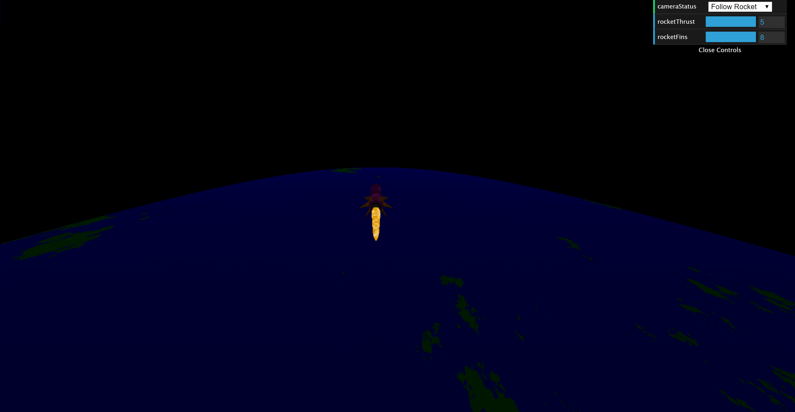

# CIS 566 Homework 2: Implicit Surfaces
_Wei (Waley) Zhang (PennKey: wzha)_

[github.io Demo](https://greedyai.github.io/noisy-terrain/)

_Note: Please run the demo in a mediumly-small sized window. The sheer size of the objects in my project has the unfortunate side effect of dragging down the frame rate significantly when the screen size is large._

## Features
- __Ray marching.__ Using camera attributes such as its position, its reference vector, its up vector, and its field of view, I cast a ray through every fragment and compute whether that ray intersects with a scene object using the scene's signed distance field (SDF), and if so, calculate where that intersection point is and which scene object I collided with. I only march rays out to a distance of 100 units from the camera. Beyond 100 units, everything is assumed to be part of the background. I also optimized the ray marching algorithm by doing the following:
  - Sphere tracing: at every step, I march forward by the distance that the scene SDF told me was "safe" to march during the last step.
  - Bounding volume hierarchy: my scene is organized as follows: the top level bounding box contains all objects in my scene; at the second level, the rocket and its exhaust flames share a bounding box, and the planet and its low-orbit asteroids also share a bounding box. Since the rocket and its exhaust flames are always together, anthe planet and its low-orbit asteroids are very close to each other, I found little benefit to add another level to my bounding volume hierarchy. Whenever I cast a ray, I ignore the signed distance fields of objects whose bounding boxes the ray will never intersect, while progressing down the hierarchy recursively.

- __Various SDFs.__ My scene contains the following objects (and their associated SDFs):
  - Rocket: my rocket contains a body, a nose, a nozzle, and fins. The nozzle was created using the Subtraction SDF operation on two capped cones. The fins are essentially triangular prisms (with an arbitrary triangular face), so I had to write a custom "primitive" for computing their SDF. the fins, nose, and nozzle are attached to the rocket body using the Smooth Blend SDF operation.
  - Rocket exhaust: I also simulated flames coming out of the nozzle of the rocket using SDFs. The flames were essentially a Smooth Blend of an series of ellipsoids that decrease in size the further they are from the nozzle.
  - Planet: a large spherical planet was also created.
  - Asteroids: I manually created 20 asteroids around the equator of the planet. Each asteroid was created using the Intersection SDF operation on a displaced rectangular prism and an ellipsoid. The rectangular prism was displaced using a combination of sine and cosine functions to create realistic-looking craters on the asteroids.

- __Animations.__ I animated the following scene attributes:
  - Rocket position and rotation: the rocket travels in a circular orbit around the planet while rotating clockwise when looked at from its rear. The rocket is tangent to the surface of the planet at all times. Trigonometric functions were used to do this animation.
  - Rocket exhaust: the rocket exhaust oscillates regularly behind the rocket and varies in length depending on the speed of the rocket (a variable that the user can change via dat.GUI). The oscillation is controlled using a triangle wave. The exhaust's texture is also animated. At any given time, the composition of white and yellow in the exhaust flames is determined using a fractal brownian motion (FBM) with a standard noise function with quintic falloff for interpolation.

- __Procedural texturing and shading using surface normals.__ The objects in my scene are textured as follows:
  - Rocket: the texture of the entire rocket is computed using a fractal brownian motion (FBM) with a standard noise function with quintic falloff for interpolation. However, to differentiate between different parts of the rocket (fins, body, nose, nozzle), the inputs to the noise function differs. For example, the input to the noise function for the nose cone and the fins was computed radially, whereas the input to the noise function for the body and nozzle are computed normally. A different mixture of colors is also used for each rocket part to further differentiate them.
  - Rocket exhaust: described above in teh animations section.
  - Planet: the texture of the planet was computed using summed FBM with a worley noise function clamped to fixed maximum value. To shrink the 3D space down to the 2D worley noise algorithm, I computed values similar to the spherical angles (_but not exactly the spherical angles_) for each point on the surface of the planet, and inputted those values into the worley noise function. The resulting noise value was divided between water and land based on a hard threshold.
  - Asteroid: the texture of the asteroid was computed similarly to that of the planet: summed FBM with worley noise inputted with "spherical" angles. However, I also transformed the resulting noise via a bias function with base 0.7 to achieve fast texture transitions on the asteroids.
  - Lighting: the lighting in the scene is computed using the Blinn-Phong reflection model, which combines Lambertian shading, specular highlights, and ambient light. There is a point source of light (aka the "sun") shining towards one hemisphere of the planet. To compute Blinn-Phong lighting, the normal at each surface point in my scene was estimated using an approximated gradient. The background is black, resembling that of empty space.

- __User controls via dat.GUI.__ The user can control three features in my scene. First of all, they can select to fix the camera behind the rocket so that they don't have to scroll the camera every time the rocket leaves the screen as its orbits the planet. Of course, the user can unfix the camera at any point if he/she wishes to explore the scene independently. Secondly, they can change the thrust of the rocket. Increasing the thrust of the rocket increases its orbital speed and rotation speed, and the rocket exhaust flames will grow larger/longer to show this effect as well. Finally, they can change the number of fins on the rocket to any whole number between 2 and 8 inclusive.

## Screenshots

Without lighting (ie. just the material base colors)

With Bling-Phong shading (notice the shadows/specular highlights on the asteroid and the rocket)

With shading, at nighttime, with max thrust and 8 fins

## Citation
I used various primitive SDF implementations from Inigo Quilez's website [here](http://iquilezles.org/www/articles/distfunctions/distfunctions.htm), as well as the corresponding Shadertoy [here](https://www.shadertoy.com/view/Xds3zN).
